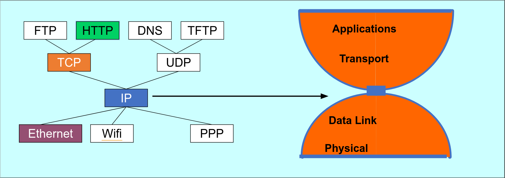

# Лекция 1. Введение

Мы будем обсуждать общие идеи как работают сети сейчас, историю часто будем скипать.

Мы хотим, чтобы компьютер A и компьютер B могли обмениваться сообщениями между собой.
Простейшее решение задачи — соединить два компьютера проводом и по проводу гонять сообщения.
Изначально так и было, но компьютеров становилось все больше.
Проводить \\(n^2\\) проводов, чтобы соединить все компьютеры попарно, стало невозможным.

Можно сделать так, как делалось раньше в телефонах.
Компьютер A говорит, что хочет поговорить с компьютером B.
Промежуточный узел замыкает провод компьютера A на провод, идущий к компьютеру B.
У такого подхода есть проблема — число проводов в узле ограничено.
Кроме того, канал часто простаивает — компьютеры не отправляют много сообщений подряд.

Мы хотим, чтобы по каждому проводу могло общаться много устройств. 
Разобьем сообщение на небольшие куски (пакеты) (1-1.5кБ).
Компьютер A отправляет кусок некоторому узлу C, тот передает дальше, и так далее, пока кусок.
Главное преимущество подхода — мы используем каналы только тогда, когда передаем данные.

В интернете есть **hosts** (хосты), которые общаются, и "коробочки", которые пересылают данные, коробочки соединены linkами.
Коробочки бывают разных видов — роутеры, свитчи, маршрутизаторы, коммутаторы - о них мы поговорим позже.

Интернет, это не "штука, которая есть", это множество независимых сетей, которые общаются друг с другом.

Минимальное время передачи пакета — число узлов в пути * размер пакета / пропускную способность канала.

Данные между узлами передаются с помощью различных соединений:
- Витая пара — два медных провода. 100 Мб/с - 10 Гб/с.
- Коаксиальный провод - в РФ не встречается, в Европе и США распространены (legacy).
- Оптоволокно — стекло, проводящее световой сигнал. 10-100 Гб/с.
- По воздуху:
  - WiFi: 10-100 Мб/с.
  - Мобильные сети, например 4G: 10 Мб/с.
  - Bluetooth
  - Спутник: 45 Мб/с.

## Направление пакетов

Есть две задачи: **forwarding** и **routing**.
- Forwarding - устройство __локально__ по таблице маршрутизации решает, куда переслать пакет.
- Routing - __глобальная__ задача построения таблиц маршрутизации.

Routing очень сложен, т.к. устройства могут отваливаться, провайдеры не хотят делиться устройством своей сети, есть разные целевые функции, которые мы хотим оптимизировать.
С картой всех компьютеров мы могли бы написать Дейкстру, но собрать карту всего интернета невозможно.

## Congestion

В роутер может прийти несколько пакетов одновременно, они кладутся в некоторый буфер.
Буфер конечен и если место кончилось, пакеты дропаются, происходит congestion.
Большая часть потерь пакетов происходит из-за этого.
Главное отличие дорогих роутеров от дешевых заключается как раз в размере буфера.

Хочется контролировать congestion - будем слать пакеты, пока они не начинают дропаться.
При дропе будем понижать скорость посылки.
Если все люди используют один и тот же алгоритм, то использование канала будет честным.
Но кто-то плохой может не ограничивать свою скорость и забить канал своими пакетами.
С течением курса мы будем понимать, что многое в интернете построено только на доверии.
Но плохим людям вручную могут отключить интернет или даже посадить.

## Протоколы

Протоколы описываются в документах RFC (Request for Comments) умными людьми.
Координирует новые протоколы в основном IETF (Internet Engineering Task Force).
Умные люди создают RFC Draft, который может меняться, его обсуждают ещё более умные люди и, возможно, принимают.
Есть ещё также ISO (International Organization for Standartization), у них крутые стандарты, но за них нужно платить и они часто оторваны от жизни.

Изначально протоколами занимались американские военные, а они очень любят аббревиатуры, например, HTTP или TCP. До сих пор все так и называют новые протоколы.

## Уровни

Когда браузер хочет открыть страничку, он не хочет думать о битиках, которые идут по проводу.
Он просто создает пакет и говорит ОС отправить его на сервер.
Таким образом образовываются слои абстракции.

Пример:
- HTTP пакет кладется в TCP поток.
- TCP разбивает данные на пакеты и заворачивает их в IP пакеты.
- IP пакеты упаковываются в WiFi и передаются по радио.
- WiFi точка принимает пакет, смотрит на пакет, видит, кому его надо передать и передает следующему узлу.

### Модель пяти слоев

1. Application - как приложение получает данные (HTTP, DNS, IMAP)
1. Transport - как запрос передается целиком, не повреждается и т.д. (TCP, UDP)
1. Network - как пакеты передаются по сети (IP, больше ничего (за исключением локальных сетей))
1. Link - как логически передать биты (Ethenet, WiFi, PPP)
1. Physical - как физически передать биты (WiFI)

IP работает поверх всяких link протоколов, над IP работают TCP и UDP, над которыми уже все происходит.

## Модель ISO/OSI (ЭМВОС)

- L7: application
- L6: presentation - здесь происходит шифрование HTTPS.
- L5: session - открытие и закрытие соединения между клиентами.
- L4: transport
- L3: network
- L2: link
- L1: physical

Эта модель была создана до интернета, поэтому она не совсем соответствует инженерной реальности.
Важно запомнить номера уровней, их часто используют.

Все эти модели всегда представляют реальность.
Например, VPN работает поверх L4, но предоставляет протокол L2.
Можно тогда скопировать всю иерархию и поставить копию поверх исходной, тогда схема похожа на реальность.
Кроме того, иногда нижние слои смотрят на верхние, например L2 смотрит на IP-адрес.