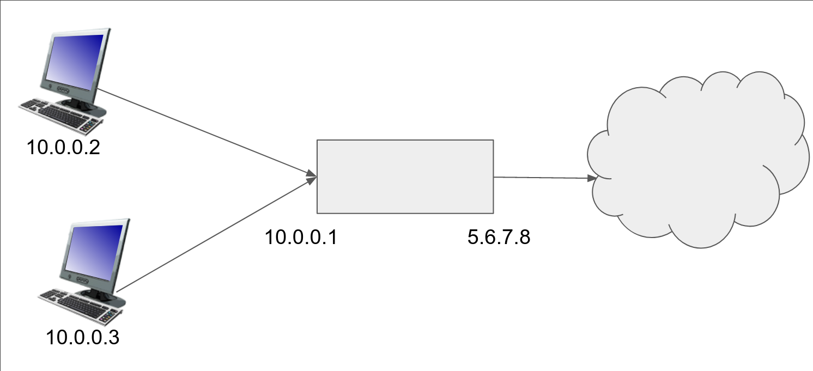
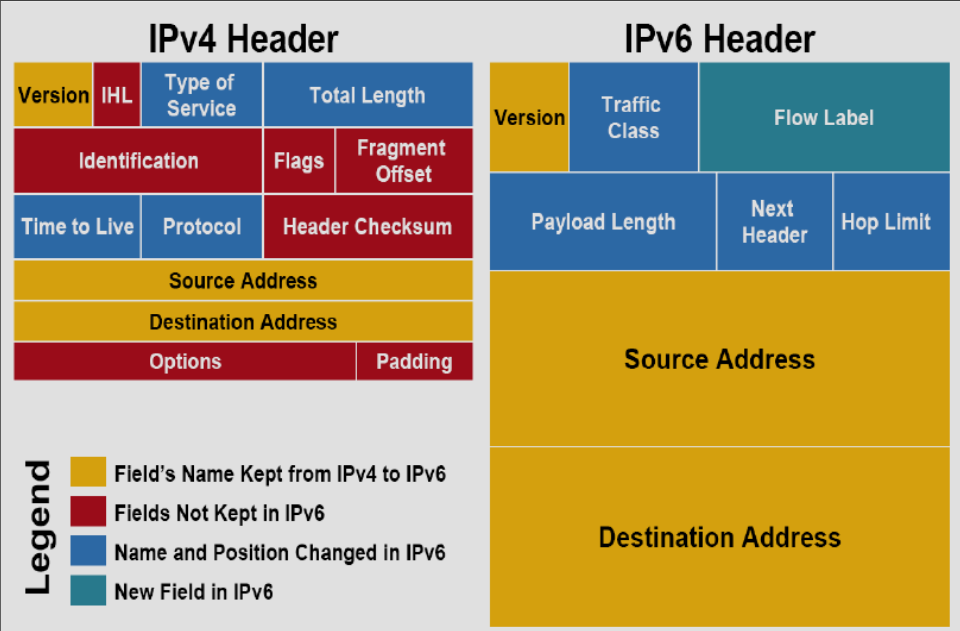

# Лекция 2. IP

Исторически протокол IP был 4-й версии, первые три не взлетели.
Адрес - 32 бита, записанные как, например, 87.250.250.242.
Каждый байт пишется в десятичной системе через точку.
Есть проблема — компьютеров больше, чем \\(2^{32}\\) штуки.

Поэтому был создан IPv6: 128 бит.
Адрес обычно разбивают на 8 кусков по два байта, которые записываются четырьмя шестнадцатеричными цифрами.
Пример: 2a02:06b8:0000:0000:0000:0000:0002:0242. Это **каноническая запись**.
Часто получается много нулей, поэтому одну группу нулей, идущих подряд, можно дропнуть, записав так: 2a02:6b8::2:242.
Последние две группы также можно записать как IPv4 адрес (только внешне, адреса разных версий не связаны).

## IP сети

Часто нужен не один адрес, а много.
Один из способов говорить про много адресов — **сеть**.
Зафиксируем префикс адреса и скажем, что все адреса, начинающиеся с этого префикса, находятся в этой сети.
Тогда пишут адрес и длину префикса через черту: 87.250.250.0/23.
Также иногда пишут **маску** вместо префикса, где префиксные биты - 1, а остальные 0.
Иногда ещё пишут дополнение к маске, называемое **wildcard**. 
Адрес с постфиксом только из нулей или единиц обычно нельзя назначать компьютерам в сети.
Есть исключение если сеть /31, т.к. иначе её вообще нельзя использовать.

## Маршрутизация

Таблицы маршрутизации используются сетями. Пример:
```
192.168.99.0/24 dev wlan0

0.0.0.0/0 via 192.168.99.1
```
Расшифровка: если пакет направлен на адрес из подсети 192.168.99.0/24, то он отправляется в WiFi сеть wlan0, чтобы пакеты дошли другим устройствам в этой сети.
Если пакет направлен на любой адрес, то он отправляется в 192.168.99.1 (роутеру).

Если пакет не попадает под какое-либо правило, то мы его дропаем.

Когда по адресу мы решаем, по какому из правил действовать, мы выбираем наиболее ограниченное правило, т.е. то, где сматчилось больше всего битов. Пример: 192.168.99.17 пойдет по первому правилу, а не по второму.
Это явление называется **LCM (Largest Common Mask)**

Вместо 0.0.0.0/0 часто пишут default.

## Получение IP адреса

IANA - Internet Assigned Numbers Authority, присваивает номера в интернете, в частности IP адреса, но не только, например 4 и 6 для версий IP выдала бы IANA, если бы она существовала в момент создания этих протоколов.
Существуют также организации, которые выдают адреса более локально, например RIPE (Regional Internet Protocol Exchange).

Раньше IANA выдавала таким организациям много адресов, частные клиенты обращались к этим организациям и брали адреса из их списков.
Для IPv6 выдача работает так и до сих пор. Кроме того, все адреса выдаются из 2000::/3, чтобы не выдать слишком много.
Так как адреса v4 у IANA и локальных организаций кончились, адреса приходится покупать.

Адресов v6 хватает, но их не все поддерживают, на данный момент только ~36% устройств.
Большему распространению мешает отсутствие поддержки софтом или железом.
Кроме того, для компаний нет выгоды переходить на v6.
В РФ оборудование для слежки за трафиком не поддерживает v6, поэтому у нас только 10% поддержки v6.

IPv6 подсети выдают хотя бы размером /48, а на одно устройство выдается обычно /64, чтобы внутри компьютера тоже была адресация.

## Особые адреса

Loopback - направляет пакеты от себя себе.
- 127.0.0.1/8
- ::1/128

Несуществующий адрес (можно хранить как sentinel, что адреса нет)
- 0.0.0.0/8
- ::/128

Если слушать на 0.0.0.0, то на этот адрес приходят все пакеты.

Для локальной сети:
- 192.168.0.0/16
- 172.16.0.0/12
- 10.0.0.0/8
- 100.64.0.0/10
- fd00::/8 - после fd необходимо генерировать 56 битов случайно, суффикс можно задавать произвольно. С хорошим рандомом велик шанс, что этот адрес уникален глобально. Правда, он не маршрутизируется, т.е. от вас можно будет получить пакет, но никто не будет знать, как отправить ответ.

Адреса из этих подсетей можно брать для использования в локальной сети.
По этим адресам нельзя посылать пакеты во внешний мир.

## NAT (Network Address Translation)

Допустим, мы хотим обратиться к 8.8.8.8.
У нашего устройства нет **белого** (глобального) адреса, только **серый** (локальный), пусть он 10.0.0.2.
Устройство пошлет пакет с src=10.0.0.2, dst=8.8.8.8.
Наш роутер с серым адресом 10.0.0.1 и белым адресом 5.6.7.8 подхватит этот пакет.
Если отправить пакет как есть, то ответ придёт на белый адрес 10.0.0.2, а он не принадлежит нам.
Поэтому роутер перепишет в нём src на свой белый адрес, 5.6.7.8, и отправит пакет дальше.
Роутеру приходит ответ от 8.8.8.8, он смотрит в свою хеш-таблицу и переписывает dst на 10.0.0.2, отправляет пакет нашему устройству, все сработало.

Но что если в локальной сети есть ещё 10.0.0.3, который также отправляет пакет на 8.8.8.8?
Тогда непонятно, кому возвращать ответ.
Костыль: пакеты у нас скорее всего TCP или UDP, в которых есть порты.
Тогда роутер будет класть в хеш-таблицу не `dst -> src`, а `(dst, own_port) -> (src, src_port)`, где `own_port` - порт роутера, с которого будет отправлен пакет в глобальную сеть (выбран случайно).



У этого решения есть проблема — это не работает с чем-либо кроме TCP и UDP, поэтому ничего другого практически и не существует.

В реальности у вашего домашнего роутера часто тоже нет выделенного IP адреса и пакеты проходят несколько слоев NAT до глобальной сети.

## Ещё особые адреса

Link local адреса:
- 169.254.0.0/16
- fe80::/10

Если никто не выдает IP адреса (например, соединили два компьютера проводом), то используются link local адреса.

Broadcast:
- 87.250.250.0/23 - приходит всем компьютерам в сети. Это позволяет спамить пакетами, поэтому он не работает (работает только локально).
- 255.255.255.255/32 - приходит всем компьютерам в локальной сети (все компьютеры, воткнутые в свитч).

Иногда мы хотим посылать много кому, но не всем. Для этого есть multicast адреса.
- 224.0.0.0/4 - компьютеры, которые хотят получать с адреса в этой подсети, объявляют это и только они получают пакеты с этого мультикаста. По дефолту это выключен, можно включить локально.
- ff00::/8 - то же самое, что и в IPv4. Есть ещё выделенные адреса, которые ограничивают, насколько далеко пакет может уйти, но это экзотика.

## Структура IP пакета



- Source address, destination address - очевидно
- Первые 4 бита — версия IP (4 или 6)
- (только IPv4) IHL: Internet Header Length — длина заголовка в 32-битных словах. Размер пакета меняется, т.к. есть опциональные Options. Размер поля IHL - 4 бита.
- В IPv6 есть поле Next Header, которое говорит, что идет после заголовка. Например, TCP, UDP или IP Extension - метаданные. В каждом расширении тоже есть поле Next Header, поэтому число расширений неограниченно.
Пример extension: jumboграммы, которые превышают максимальный размер пакета для экономии на заголовках.
- Total length - длина пакета, включая заголовок (16 бит).
- Payload length - длина пакета, не включая заголовок (16 бит).
- Time to Live - один байт, который уменьшается каждый раз, когда пакет проходит узел.
  Если TTL = 0, то пакет отбрасывается и _обычно_ возвращается сообщение об этом (но не обязательно).
  Это сделано, чтобы пакеты не заблуждались в сети. Есть хак — можно узнать наш путь до некоторого узла, выставляя TTL = 1, 2, ...
  Это делает `traceroute` (или `tracert` для рабов на Windows).
  Обычно TTL=64, этого хватает, т.к. диаметр интернета ~40.
- Header checksum - контрольная сумма заголовка, кроме TTL.
  Пакеты настолько редко ломаются, что IPv6 решил это убрать.
- Padding дополняет нулями пакет, если options слишком короткий. Дополнение идет до целого числа 32-битных слов.
- Type of Service (IPv4) или Traffic Class (IPv6) - важность пакета. Важность локальна в рамках сети, например провайдер сам решает, что выставить. Последние два бита - ECN (Explicit Congestion Notification). Если отправитель его выставил и в каком-то из узлов на пути становится мало места, то он может отправить пакет дальше с пометкой Congestion Control. Когда отправитель получит пакет назад (с выставленными метками), то он должен реагировать так, как будто встретил дроп пакетов. См. [четвертую лекцию](lecture_4.md#explicit-congestion-notification)
- Flow Label (IPv6) - идентификатор потока. Роутеры будут стараться __(но не обязаны)__ посылать пакеты в одном потоке по одному и тому же маршруту, чтобы пакеты приходили по порядку.

IPv4 гарантирует, что можно передать пакет размером 768 байт или меньше (включая заголовок), IPv6 - 1280 байт, а возможно и больше. Для WiFi или витой пары обычное ограничение сверху - 1506 байт.
Максимальный размер пакета, который может передать сеть, называется **MTU** (Maximum Transfer Unit).

## Фрагментация

Если размер пакета больше, чем MTU, то пакет делится на два пакетa.
В IPv4 есть флаг (в Flags) MF, который указывает, является ли пакет частью большого пакета.
При MF в Fragment Offset пишется номер пакета в большом пакете, а Identification - идентификатор большого пакета.

Пример: был пакет с MF=0, FO=0 и случайным Id. Он не пролезает в следующую линку и образовываются два пакета:
- MF=1, FO=0, Id=Id исходного пакета
- MF=0, FO=размер предыдущего пакета, Id=Id исходного пакета.

Пакеты собирает получатель. Есть проблема — непонятно сколько ждать получения кусков пакета.
Кроме того, плохие люди могут посылать фрагменты пакета, но не все, тогда у получателя кончится память и все грустно.
Решение — получатель дропает фрагменты, а отправитель, когда не получает ответ, начинает слать пакеты меньше, чтобы они не разбивались на фрагменты.

В IPv6 нет фрагментации.

В IPv4 есть ещё второй флаг - DF (Don't Fragment).
Если он установлен, то пакет не будет разбиваться на фрагменты.

Можно бинпоиском подбирать размер пакета, который получатель может принять.
