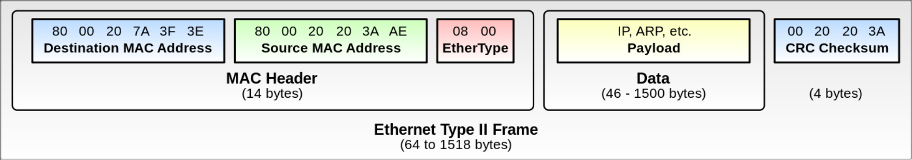

# Лекция 3. IP+Ethernet

## ICMP

ICMP — Internet Control Message Protocol.
Работает поверх IP и передает служебную информацию.
В ICMP много видов сообщений, мы поговорим только о нескольких.
В поле Protocol для IP пишется номер вида ICMP.

- ICMP Echo Request/Reply - через него работает ping.
- ICMP Destination Unreachable - при передаче пакет не достиг пункта назначения.
    Поля показывают одно из:
    - Fragmentation required - пакет больше MTU и выставлен Do not fragment в IP заголовке.
    - Destination host unreachable
    - Destination network unreachable
    - Destination port unreachable - порт (TCP/UDP) не может принять
    - \* administratively prohibited - бан от файервола
- Time Exceeded - TTL истек. 
- Trace Route - все промежуточные узлы должны отправить вам пакет.
  Есть проблема: можно поставить в src человека, который нам не нравится.
  Тогда если мы отправим один пакет Trace Route, человек получит много пакетов с разных адресов, это amplification атака и очень плохо.
  В итоге Trace Route забанен.
  В целом в ICMP требуют, чтобы возвращаемый пакет был не больше исходного пакета, чтобы не было атак.
  Кроме того, если пакет Time Exceeded потерян, то нельзя посылать ответный Time Exceeded по тем же причинам.

## Мелочи

- NAT64 - способ для IPv6 узлов общаться с узлами, которые v6 не понимают.
    Он похож на NAT, просто переписывает адреса.
- whois - утилита, позволяющая узнать по ip-адресу, кому принадлежит адрес, куда жаловаться если с этого адреса атаки, подсеть и т.д.
- tcpdump - показывает все пакеты, идущие по некоторому интерфейсу на компьютере
- wireshark - графическая программа, позволяющая просматривать пакеты.

## Ethernet и WiFi

Эти протоколы стандартизованы IEEE (той самой, которая флоаты).
Ethernet — 802.3, а WiFi — 802.11.

Для link протоколов тоже нужны адреса и мы не можем использовать IP.
Поэтому используются MAC-адреса.
Они обычно записываются в виде шести пар шестнадцатеричных цифр, например, 00:11:22:33:44:55.
Broadcast (всем в локальной сети) MAC-адрес это ff:ff:ff:ff:ff:ff.

Существуют разные "коробочки", которые могут быть использованы для передачи пакетов:
- Хаб (L1): без логики пересылает все сообщения всем подключенным клиентам. Сейчас почти не используются, т.к. они медленные.
- Коммутатор или свитч (L2): смотрит на dst адрес пакета и направляет туда, где dst находится.
  Расположение узлов коммутатор узнает, смотря на src адрес пакетов, исходящих от каждого узла.
  Если коммутаторы образуют не дерево, то все плохо — фреймы могут ходить по циклу (TTL нет), множиться и т.д.
  Простейший способ бороться с этим — не создавать циклы.
  Большинство коммутаторов, если видит mac-адрес на двух портах, то выключает один из них.
- Маршрутизатор (L3): то же самое, но на IP адресах, а не mac адресах. 

## MAC-адреса

Шесть октетов адреса делятся пополам. Первые три октета — уникальный номер организации (полученный в IEEE).
Оставшиеся октеты выставляются организацией произвольно, обычно последовательно.
Проблема: \\(2^{24}\\) адресов — мало для одной организации. Когда они кончаются, есть два варианта:
- Получить новый номер организации, но это сложно.
- Сделать идентификаторы не уникальными и использовать их заново.
  Тогда надо надеяться на то, что в рамках одной L2 сети адреса не повторяются, иначе все сломается.

В mac адресах есть два особых бита:
- Последний бит первого октета — multicast или unicast (редкость).
- Предпоследний бит первого октета — если он не выставлен, то mac адрес честный, иначе он придуман локально.

У виртуалок и всяких докеров тоже есть честные MAC адреса.

## ARP (Address Resultion Protocol)

Мы хотим отправить пакет кому-то на IP адрес, но мы не знаем его MAC адреса.
Отправим сообщение на `ff:...:ff`: "у кого есть такой-то IP адрес?"
Если у кого-то есть этот адрес, он должен ответить и сказать свой MAC адрес.

В ARP есть таймауты, по которым мы говорим, что запись старая или удаляем запись вообще.

## ND (Neighbor Discovery Protocol)

Это то же самое, что и ARP, но для IPv6.
ND ещё умеет узнавать, кто является роутером в сети (Router discovery) и Redirection - роутер может сказать, что он больше не роутер и сказать, кто теперь является роутером.

## DHCP

Допустим мы подключили наш ноутбук к сети.
Нам нужен IP адрес, чтобы общаться, при этом адрес должен быть из правильной сети и уникальный.

Простейший способ это сделать — выставить руками, в линуксе это `ip addr`, но это не универсальный вариант.
Для получения IP адреса используется протокол DHCP.
Он работает поверх UDP, который работает поверх IP.
Чтобы отправить пакет IP, нужно иметь какой-то IP адрес.
Тупик? Не совсем, будем писать в src 0.0.0.0

1. Отправляем запрос DHCP Discover всем (255.255.255.255) от никого (0.0.0.0).
1. Тот, кто выдает адреса, выдает адрес и шлёт уже на этот адрес пакет DHCP Offer.
   Потенциально DHCP серверов в сети несколько, поэтому и таких пакетов может прийти несколько.
   В это время запрашивающее устройство слушает все пакеты, приходящие на его MAC адрес.
1. Запрашивающее устройство выбирает понравившийся адрес и отправляет (с него) DHCP Request.
1. Сервер отправляет DHCP ACK.

Адреса не даются навсегда, только на время lease timeout.
Если устройство не хочет, чтобы по истечении таймаута менялся адрес, выполняется опять DHCP Request.
При этом сервер может ответить DHCPNAK и не продлевать. 