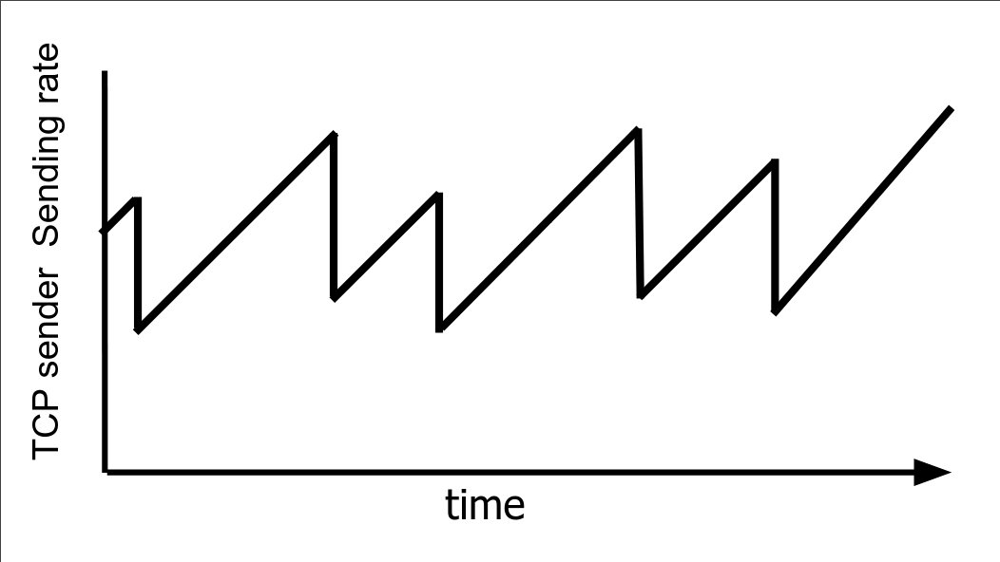
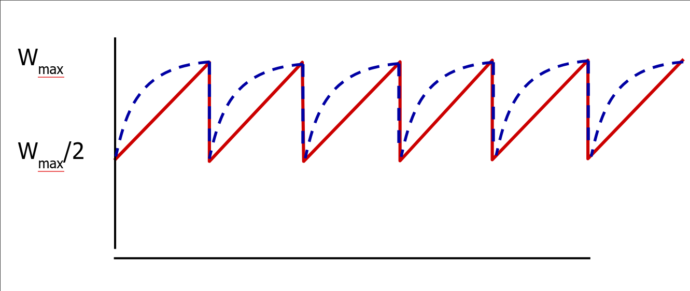

# Лекция 4. TCP, UDP.

## UDP

На одном компьютере может быть запущено много приложений, слушающих пакеты, поэтому у нас существуют **порты**.
Это числа от 1 до 65535, 0 - особое.

UDP датаграмма состоит из полей:
- Source port
- Destination port
- Length - казалось бы, в IP пакете она и так есть, но технически UDP не обязан работать поверх IP.
- Checksum - включает в себя и чексумму payload. Если она не совпадает, пакет выкидывается.
- Payload

Порты до 1024 зарезервированы для root приложений, чтобы левые программы не поднимали веб-сервера.

`netcat` - полезная утилита, которая позволяет передавать и слушать UPD пакеты.

Часто мы хотим передавать данные, которые не влезают в один пакет UDP.
Для этого мы рассмотрим протокол TFTP, он полезен для понимания TCP.

### TFTP

Разобьём данные на куски, которые влезают в пакеты.
Сервер отправляет первый кусок данных и ждёт подтверждения от клиента.
После этого сервер отправляет второй кусок данных и т.д.

TFTP используется в network boot, т.к. он очень простой.

Но TFTP работает быстро, только если задержка между сервером и клиентом мала.
Если пакет теряется, то сервер по таймауту отправляет пакет ещё раз.
Но если пакет долго шел и сервер отправил пакет ещё раз, и они оба дошли до клиента, то клиент должен отправить два подтверждения и получаются излишние пакеты.

## TCP

TCP очень сложный, мы рассмотрим только некоторые его части.

Важно понимать, что порты TCP и UDP не связаны.

IANA собирает список популярных портов с их назначением, например 80 - HTTP, 443 - HTTPS.

Поля пакета TCP:
- Source port
- Destination port
- Payload
- Data offset - размер заголовка
- Sequence number - смещение данных пакета в большом куске данных, который передаётся.
- Acknowledgement number - номер последнего пакета, который принял клиент.

Основная идея — не будем дожидаться подтверждения от получателя, отправим ему ещё данных.
Но нельзя посылать слишком много данных сразу, иначе пакеты начнут теряться.
Мы не получим ACK на какой-то пакет, и начиная с этого пакета отправим данные ещё раз.
Поэтому в TCP есть понятие **Congestion Window** - расстояние между указателем на последний отправленный пакет и последний ACKнутый пакет.
Для выбора размера окна используется Slow Start - будем экспоненциально увеличивать размер окна, пока данные не начнут теряться.

Мы не хотим отправлять ACK на каждый пакет, слишком много метаданных и мало информации.
Поэтому есть задержка, в течение которой мы ждём новые пакеты, чтобы ACKнуть сразу несколько.

Сервер перепосылает пакеты (если они потерялись) по таймауту.
Но хотелось бы, чтобы клиент уведомлял сервер, что пакет потерялся, чтобы сервер не ждал таймаут.
Это называется **Fast Retransmit**.
Если пришел пакет 1, а затем пришел пакет 3, то клиент немного ждёт (вдруг порядок пакетов перепутался) и шлёт на пакет 3 опять ACK 1.
Это значит, что клиент получил ещё пакеты (после 1), но подтвердить может только 1.

Есть также **Selective acknowledgements**.
При соединении клиент и сервер могут договориться, что они поддерживают эту технологию, и тогда клиент сможет говорить, что он получил пакеты вплоть до N-того, кроме некоторого отрезка.
Обычно эта фича выключена.

### Подбор congestion window

Исторически первый алгоритм подбора окна - AIMD - Additive increase, multiplicative decrease.
Если пакет дошел, то увеличиваем окно на 1, иначе делим размер окна на 2.

BIC - будем медленнее (по параболе) подкрадываться к окну, с которого нас сбросили.

CUBIC - если пробили окно и поднялись достаточно высоко, то начнём расти быстро.

Если у сервера много клиентов с алгоритмом CUBIC и похожими константами, разделение будет равным.
Если к этому же серверу придет клиент с AIMD, то он проиграет — ему достанется меньшая доля соединения.

BBR - давайте попробуем выбирать окно, не используя потерю пакетов.
Будем отступать, когда RTT начинает увеличиваться — это значит, что пакеты стоят долго в очередях. 
Алгоритм изначально придуман гуглом, он включил его у себя и получил улучшение в десятки процентов.
Но при включении BBR в интернете стало все плохо - BBR доминирует над кубиком и забирает себе канал, т.к. CUBIC наступает на потерю пакетов, а BBR немного отступает до неё, продолжая посылать пакеты быстро.

BBR 2 - BBR с костылями, чтобы не доминировать над кубиком.

### Explicit Congestion Notification

Как мы уже говорили, в IP пакете есть флаги ECN-Enabled и EC (случился).
Если ECN-Enabled выставлен и роутер считает, что скоро пакеты начнут теряться, то он выставит в пакете EC.
Но ECN получит сервер, а не клиент.
Если клиент просто отошлёт назад пакет с выставленными ECN и EC, то непонятно, на каком пути случился congestion - от клиента к серверу или наоборот.
Поэтому _в TCP пакете_ есть флаг ECE - Explicit Congestion Echo, он гласит, что congestion случился на пути именно от клиента к серверу.
Если сервер получает пакет с ECE, то он должен уменьшить своё окно и отправить клиенту пакет с выставленным CWR (Congestion Window Reduced). 
В это время клиент, пока не получит CWR, будет слать пакеты с ECE.

Бывает такая ситуация, что данные доходят до ОС, но пользовательское приложение не успевает доставать данные из буфера ОС.
Тогда нужно просить сервер притормозить, за это отвечает поле window size.
Через него клиент говорит серверу, какой размер окна нужно выставить, в частности можно приостановить трафик, передав туда 0.

### TCP 3-way handshake

В идеальном мире клиент мог бы просто прийти к серверу и начать посылать ему данные.
Сервер при получении такого пакета сервер создавал бы буфер, выделял память и начинает работу.
Проблема: создание TCP-соединения это дорого - нужно выделять буфера, сокет, чего-то думать.
Плохие люди могут кушать таким образом ресурсы сервера, посылая пакеты с разных адресов (фейковых) и открывая много соединений.
Клиенту этот процесс ничего не стоит (послать один пакет), поэтому это очень простая атака.

В реальности клиент сначала посылает пакет с выставленным флажком SYN.
Если сервер хочет установить с клиентом соединение, то он отправляет SYN-ACK, в котором есть просьба начать нумеровать поток данных с некоторого числа.
Число считается statelessно из номера клиента и некоторого секрета на сервере.
Поэтому выделение ресурсов на сервере произойдет только после ответа клиента с ACK, который при этом должен учесть просьбу о нумерации.
Таким образом сервер проверяет адекватность клиента — что он слушает пакеты на src адресе (не фейкует его) и что он готов выделить сколько-то ресурсов, чтобы установить соединение.

Есть проблема — мы не можем создать соединение быстрее, чем 1.5 RTT.
Давайте будем выдавать клиенту число, называемое SYN Cookie, по которому он может обходить three-way handshake.

Флаг FIN гласит, что эта сторона больше не будет передавать данные.
Для полного закрытия нужен FIN с обеих сторон.
Проблема: девайс или прога может умереть и соединение не закроется. Если прога умирает, но ОС работает, то ОС говорит, что на порте никто не слушает. Если нет, то соединение закроется по таймауту.

В каждом TCP соединении есть на самом деле два канала — обычный и Urgent. Это экзотика.

Флаг PSH (Push) требует, чтобы ОС отдала приложению данные сразу и не делала буферизацию.