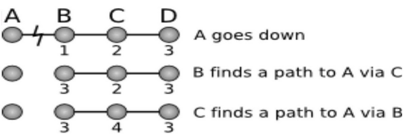

# Лекция 5. Роутинг

Как мы говорили на первой лекции, компьютеру/роутеру нужна таблица, чтобы знать, какие пакеты отправлять в какую сторону.
В рамках домашней сети это просто, но для провайдера задача построения таблицы будет не простая.

Способы построения таблиц:
- Статический - в рамках маленькой сети/дома можно руками построить таблицу.
- Link state - строится полная карта сети. 
- Distance vector - используется только информация о локальном участке сети. 
- Software-defined networks - если можно на компьютере запустить программу, которая соберет всю информацию о сети, запустит алгосики, примет все решения и загрузит эту информацию на все устройства в сети.

В большинстве сетей используется link state или distance vector.

## RIP (Routing Information Protocol)

Пусть в сети есть маршрутизатор, который знает, как отдать пакеты в сеть 1.0.0.0/24.
Оно расскажет своим соседям, что умеет доставлять пакеты в 1.0.0.0/24 с путём длиной 0 узлов.
Соседи этого маршрутизатора тогда узнают, что они могут доставлять пакеты в 1.0.0.0/24 с путём длиной в 1 узел, если отправить в тот маршрутизатор.
Соседи также распространят эту информацию дальше, при различных длинах пути выбирается путь с минимальной длиной.

В RIP расстояние 4-битовое, при этом 1111 выделено как недостижимое значение.
Поэтому RIP применим только в сетях с диаметром \\(\le 14\\).

Когда мы посылаем сообщение соседям, что мы знаем?
- Если к нам подключили новое устройство
- Нас попросили это сделать
- По таймеру (обычно 30с)

Есть проблема — злоумышленник может сказать, что у него до всех адресов расстояние 0 и скушать все пакеты в сети.
Это не чинится.

Допустим, некоторый узел пропал из сети.
Соседние с ним узлы поймут об этом либо по таймауту, либо линк об этом сообщит.
Тогда соседние узлы пересчитывают свои маршруты и не посылают больше пропавшему узлу пакеты.

У нас есть проблема count to infinity, когда при пропаже узла мы будем по старой информации пересчитывать и находить путь, которого нет.

Есть частичное решение — если узел A сказал узлу B, что у него есть путь до C, то B никогда не скажет узлу A об этом пути.
Оно не всегда работает.

Есть ещё одна защита — если узел узнал, что B пропал, то он говорит соседям, что расстояние до B - 16, т.е. он недостижим.

В реальной жизни RIP уже не используется.

## OSPF (Open Shortest Path First)

Каждый узел строит карту сети и запускает Дейкстру.
Важная идея — если у всех узлов одинаковая карта, то каждый узел может принять локальное решение.
OSPF может работать в сетях до 10000 узлов (примерно).

Есть одна проблема — сообщение о том, что линк пропал, доходит не мгновенно, поэтому у узлов происходит рассинхрон по карте.

Мы не обязаны строить карту всей сети.
Можно разделить сеть на зоны и для каждой зоны будет своя карта с некоторыми "мостами" между ними.

## IS-IS

Похож на OSPF, но работает не поверх IP, а через CLNS (не обязательно знать, что это).

## BGP

OSPF нельзя использовать на всю планету, т.к.:
1. Карта сети не влезает в память.
2. Мы не хотим, чтобы все в мире знали внутреннее устройство сетей.

BGP - протокол, работающий в интернете, который оперирует абстракцией автономной системы.
Автономная система — организация, в который есть некоторые соединенные устройства и есть внешние маршрутизаторы, для которых внутренности сетей не различимы.
Таким образом мы стягиваем автономные системы в одну вершину, похоже на конденсацию графа.

У каждой автономной системы есть номер - 16-битное число от IANA.

Сам алгоритм похож на RIP на автономных системах вместо узлов, но системы рассказывают друг другу не расстояния, а сами пути.

Выбор пути производится по следующим правилам (правила с меньшим номером приоритетнее):
1. Локальные административные критерии.
2. Длина пути (в количесте автономных систем).
3. т.д. (не будем рассматривать)

Проблема Count to infinity решается тривиально — отбрасываются маршруты, которые проходят через себя.

Проблема того, что информация о потере узла не приходит мгновенно, неисправима.

С путём также можно передавать метаданные в виде `a:b`, где `a` — номер автономной системы, которая прикрепила данные
, и `b` — код сообщения, которое эта система передает.
Нет универсального соглашения об этих кодах, нужно договариваться с соседями вручную.

Looking glass - сервис, который предоставляют многие системы, который позволят посмотреть информацию BGP.

Если некоторая система A хочет предпочитать одно соединение с другой системой вместо другого, то она может по одному соединению слать путь A, а по другому путь A-A-A.
Этот хак очень распространён.