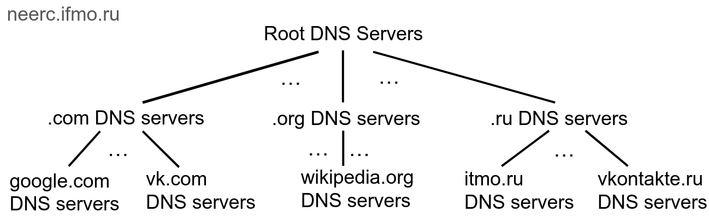
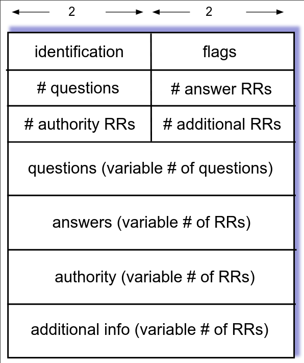

# Лекция 7. DNS

DNS берёт человекочитаемое имя домена и преобразует в IP-адрес.

- Имя состоит из лейблов, разделенных точками
- Каждый лейбл не длинее 63 символов
- Имя в целом не длинее 254 символов
- Символы бывают [a-zA-Z0-9\\-]
- Имена регистронезависимые

Не все пишут на латинице, поэтому ввели IDN (Internationalized domain name), которая конвертирует имена с юникодом в ascii имена.
Это открывает возможности для фишинга — заменяем символы на похожие.
Браузеры ищут не-ascii символы в ascii именах и показывают преобразованный результат, чтобы такого не случалось.

Где будем хранить мапинг имя -> IP?

### /etc/hosts

Это файл, в котором лежат мапинги имен доменов на IP-адреса.
Разумеется, это не масштабируется.
Кроме того, мы не всегда хотим хранить только IP, например:
- A: IPv4
- AAAA: IPv6
- CNAME: алиас на другое имя
- PTR: алас на другое (различия увидим дальше)
- TXT: любой текст
- NXDOMAIN: null
- MX: почтовый сервер

Будем шардировать по лейблам:
 

Процесс поиска выглядит так:
1. Спрашиваем у коренного сервера: "где neerc.ifmo.ru?".
2. Коренной сервер говорит: "про .ru надо спрашивать у вот этого сервера".
3. Спрашиваем у .ru сервера
4. т.д.

Root DNS серверов "существует" 13, но на самом деле это много серверов за 13 адресами.
Они зашиты во все ОС.
Их только 13, т.к. иначе информация о них не влезает в один DNS пакет.

Изначально было 7 top-level доменов, таких как .com, .org, .net и т.д..
Потом добавили домены стран (всегда два символа) и локализованные домены стран (.рф).
В начала 10-х годов IANA решила заработать денег и позволила за деньги регистрировать себеg примерно любой домен первого уровня.

### Resource Records

В линуксе есть утилиты `nslookup` и `dig`, которые делают DNS Lookup.

Для того чтобы организовать иерархическую структуру, есть несколько запись вида NS: "Я не знаю, но знаю того, кто знает".
Также есть Glue records, которые подсказывают адрес сервера, который знает (вместо имени).

У наивного процесса DNS Lookup есть проблема - он очень долгий, мы не хотим обходить дерево на каждый запрос.
Поэтому мы будем запоминать ответы в кеше.
К каждому ответу DNS сервер прикрепляет TTL, в течение которого можно считать, что ответ не изменился.
Чем выше в иерархии сервер, тем больше TTL.

### Recursive resolvers

Мы не хотим делать DNS Lookup на своём компьютере, поэтому существуют рекурсивные серверы, которые сами выполняют лукап по запросу и кешируют ответы.

Адреса таких серверов обычно сообщаются через DHCP, но его можно и настроить руками в `/etc/resolv.conf`.
В этом же файле можно написать `search bar` под `nameserver a.b.c.d`.
Тогда если сервер не ответит на запрос `foo`, то будет резольвиться `foo.bar`. 

### Reverse DNS

DNS возвращает по имени адрес, но иногда мы хотим сделать наоборот.
Для этого сделана специальная top-level зона `.arpa`, dns lookup в которой дает адрес по имени.
Домены, по которым идут запросы выглядят так:
- ipv4: `132.215.234.77.in-addr.arpa`
- ipv6: `1.2.3...a.ip6.arpa`

С ipv4 это сложно, т.к. границы подсетей не обязательно проходят по октетам.
Поэтому нужно много записей для каждого октета.
В ipv6 сделали каждый символ в адресе отдельным лейблом, чтобы частично избежать этого (если граница проходит по 16-битному куску, т.е. символу, то проблема остается).

За невалидные зоны никто не отвечает.

Чтобы доказать, что A владеет доменом B, некто C может попросить добавить произвольный текст в TXT запись для домена B.

Можно спрашивать не конкретную запись, а ANY, т.е. запрос отдать все записи.
Это deprecated, т.к. это генерит много трафика по малому объему трафика.
Обычно на ANY не отвечают тем, чем надо.
Например Cloudflare отвечает "RFC8482" в поле HINFO. RFC8482 депрейкейтнул запрос ANY, а HINFO - поле информации о железе DNS сервера.

### DNS протокол

Запросы и ответы имеют одинаковый формат:

- identification - idшник, который может выставить клиент и тогда сервер обязан будет ответить с таким же id.
- flags - например, разрешить ли дальше спрашивать рекурсивно
- authority - информация, для которой сервер является авторитативным
- additional info - например, ip адреса NS серверов.

Изначально DNS работал поверх UDP, но там есть ограничение размера пакета в 512 байтов.
Можно работать поверх TCP, в частности если ответ не влезает в UDP, то сервер может выставить флаг просьбы подключиться по TCP.

Оба эти варианта не используют защиту. Поэтому были сделано DNS over TLS и DNS over HTTPS, чтобы провайдер и третьи лица не видели, куда мы заходим.
Over TLS гоняет те же самые бинарные пакеты, а over HTTPS гоняет жсоны.

### EDNS

Это расширение DNS, которое добавляет ресурс OPT - произвольная информация.
Примеры использования:
- флаг того, что по UDP можно посылать больше, чем 512 байт.
- IP адрес клиента.

IP адрес клиента полезен, если рекурсивный DNS находится далеко от клиента.
Тогда (без передачи IP адреса клиента) DNS сервер ответит адресом, ближайшим к рекурсивному DNSу, а не к клиенту.

## Уязвимости DNS

Злоумышленник может ответить на ваш запрос DNS и дать вам скомпрометированный IP адрес.
Против этого есть identification.
- Злоумышленник может подслушать id, и от этого мы не защитимся.
- Злоумышленник может послать 65534 ответов со всеми id, если успеет.

Против второго метода можно рандомизировать капитализацию букв в имени домена и тогда DNS сервер должен будет ответить с такой же капитализацией.
Это добавляет энтропии, что усложняет подбор.

### DNS Cache posioning

Есть и другая атака — на рекурсивный сервер DNS, чтобы он всем отвечал неверные адреса.

Защита:
- Смена identification при рекурсии.
- Добавление энтропии в запрос, как и раньше.

Но это все не слишком безопасно. Добавили **DNSSEC** (DNS Security Extensions): у authoritative серверов есть приватные ключи, при этом каждый такой ключ подписан ключом сервера, который стоит выше в иерархии.

- RRSIG - подпись, идёт после записи, которая подписывается
- DNSSEC - публичный ключ
- DS - "за DNSSEC этой записи отвечаю не я, а другой сервер". Обычно совпадает с NS.
- NSEC - "такого имени домена нет". С помощью этой записи можно было перебором построить список всех записей, из-за этого была сделана замена - NSEC3.

## Zone transfer

Если за одну и ту же зону отвечают несколько серверов, то хочется уметь их синхронизировать.
Поэтому был запрос AXFR, который позволял получить все записи. Проблема очевидна — маленький запрос и большой ответ, поэтому это выключили.

Как получить себе домен?
- Есть оператор некоторой зоны, например `.com`. Ему принадлежат сервера, которые отвечают за соответствующую зону.
- Есть регистратор, который за деньги добавляет домен в список доменов в некоторой зоне на некоторое время. Регистратор позволяет либо добавить NS запись, которая перенаправит на ваш DNS сервер, либо захостить DNS, который будет направлять на нужный ip.

Операторы зоны также предоставляют `whois` - информацию о доменах, например кто зарегистрировал, куда жаловаться и т.д.