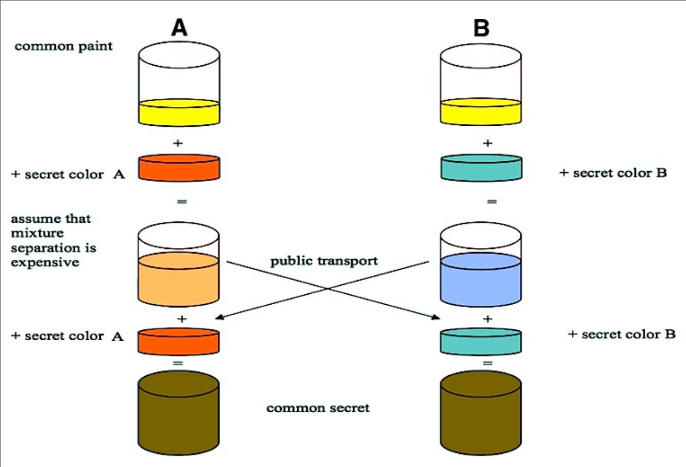

# Лекция 8. HTTP(S)

## HTTP

Это очень простой протокол, работает поверх TCP, текстовый.
Самый базовый функционал — просим файл, нам дают его с метаданными (заголовком).

URI - Uniform Resource Identifier, обозначает адрес ресурса (который мы запрашиваем).

`scheme:[//[user[:password]]@]host[:port]path[?query][#fragment]`

- scheme - протокол, по которому мы обращаемся к ресурсу.
- порт обычно не надо указывать, т.к. для каждой схемы есть дефолтный порт

### Методы HTTP

- GET: запрашивает заголовки файла и сам файл. Метаданные и файл разделены двумя переносами строки
- HEAD: запрашивает только заголовки, нельзя передавать никакие данные помимо заголовка. Запросы GET и HEAD идемпотентные, т.е. видимое состояние сервера не должно от них меняться.
- POST: отправить данные. Очевидно не идемпотентно и браузер предупреждает перед тем, как отправить POST дважды.
- PUT: заменить файл
- DELETE: удалить файл
- PATCH: изменить часть файла
- OPTIONS: "какие запросы можно посылать?"
- CONNECT: устанавливает двустороннее соединение, как будто TCP. Используется в том числе в вебсокетах.
- TRACE: ответь на запрос теми же заголовками

Заголовок это key-value пара, разделенная `:`.
В частности, необходимо указать заголовок `Host`.

### Коды ответа

В первой строке ответа указывается код ответа.

Интересные коды:
- 1xx: Informational
  - 101: Switching Protocols - переход с HTTP на что-то другое, например вебсокет
- 2xx: Все хорошо
  - 200: OK
  - 201: Файл был создан
  - 204: No Content - файл есть, но он пустой или запрос это HEAD и файл отдавать не надо
- 3xx: Redirection
  - 301: Moved Permanently - перенаправление на другой адрес, можно кешировать навсегда
  - 302: Found - то же самое, но временно, нельзя кешировать
  - 307: Temporary Redirect - как 302, но с адекватным названием
  - 304: Not Modified - этот файл есть в кеше запрашивающего, не надо его отдавать
- 4xx: Client Error
  - 400: Bad Request - запрос не понятен серверу
  - 401: Unauthorized - не авторизован
  - 403: Forbidden - нет доступа к файлу (обычно у самого сервера)
  - 404: Not Found - файл не найден
  - 418: I'm a teapot - первоапрельская шутка
  - 451: Unavailable For Legal Reasons - нельзя отдавать файл по закону
- 5xx: Server Error
  - 500: Internal Server Error - что-то пошло не так
  - 502: Bad Gateway - серверу для выполнения запроса нужно сделать запросы, но тот сервер недоступен

### Заголовки

Со стороны клиента:
- `Host` - с какого хоста получаем
- `Connection: Keep-Alive`, чтобы не закрывали соединение после отправки данных (будут ещё запросы), т.к. повторное открытие это опять three-way handshake
- `Accept-Encoding: gzip, deflate` - нам можно отправить сжатый ответ
- `Accept-Languages` - локали клиента.

Со стороны сервера:
- `Content-Type` - тип данных в ответе
- `Content-Length` - длина данных в ответе
- `Refresh: n; url` - через n секунд загрузи `url` вместо этой страницы.

#### Проверка изменения

Мы хотим говорить серверу, что у нас есть некоторая версия файла в кеше, чтобы не загружать файл заново, если он не изменился.
В GET для этого можно:
- написать `If-Modified-Since: дата`
- передать `If-None-Match` с некоторым ETag (хеш)

#### Ranges

Заголовок `Range` позволяет запрашивать часть файла, они будут отданы с заголовком `Content-Range` или будет 416 Range Not Satisfiable.
Это сделано для ситуации, когда соединение прерывается и не хочется загружать большой файл с начала.

С `Range` логично передавать какую-то проверку того, что файл не изменился, для этого есть `If-Match` и `If-Unmodified-Since`.

#### Кеширование

Сервер может сказать `Expires: дата` и тогда сервер даёт гарантию того, что до даты ресурс не изменится.

Для прокси-серверов есть заголовки:
- `Cache-Control: no-cache` - не кешировать запросы
- `Cache-Control: only-if-cached` - отдавать только из кеша
- `Cache-Control: max-age=n` - отдавать из кеша только если он не старше n секунд
- `Age` - прокси-сервер пишет возраст кеша.
- `Pragme: no-cache` - сервер с ресурсом говорит прокси-серверам не кешировать (в браузере кешировать всё ещё можно). Обычно включен.

#### User-Agent

Заголовок `User-Agent` позволяет серверу различать браузеры.
Это позволяет поддерживать IE 5, в котором частично сломан JS.

#### Cookies

Позволяет хранить данные на стороне клиента.

Пример:
```
Set-Cookie: userLogin=melnikov; Expires=Wed, 09 Jun 2021 10:18:14 GMT;
Domain=.ifmo.ru; Path=/; Secure; HttpOnly
```

- `Expires` - дата истечения куки.
- `Domain` - домены, которым можно отдать куку (поддомены указанного домена).
- `Path` - фильтр по пути сайта, куда можно отдать куку
- `Secure` - если выставлено, то можно передавать только по HTTPS.
- `HttpOnly` - запрещает JS доступ к этой куке.

Клиент при любом запросе дописывает в заголовок `Cookie` имя куки и значение.

Куки нельзя ставить на домены первого уровня по очевидным причинам.
На некоторые домены не первого уровня тоже нельзя ставить куки, например `.co.uk`. 

### Версии HTTP

Появился HTTP/2, названный также SPDY:
- Позволяет по одному TCP соединению отправлять несколько файлов параллельно.
- Server push - сервер может отправлять файлы, которые ещё не запрашивал.
- Почти все зашифровано.

HTTP/3 реализовали поверх UDP через QUIC (почти TCP поверх UDP, но на клиенте).

## Шифрование

Асимметричное шифрование происходит, когда у каждого пользователя есть два ключа — публичный и приватный. Можно делать две вещи:
- Публичным ключом можно зашифровать данные и тот, у кого есть приватный ключ, сможет их расшифровать
- Можно добавить к сообщению хеш такой, что любой человек с публичным ключом сможет проверить, что создатель действительно является владельцем приватного ключа.

Шифрование Диффи-Хеллмана позволяет получить общий приватный ключ, который никто кроме них не знает.


## TLS

TLS позволяет обернуть соединение в себя и получить зашифрованное соединение.

Раньше он был известен как SSL.
Есть deprecated версии с дырами: SSL, SSL 2.0, SSL 3.0, TLS 1.0, TLS 1.1.

TLS 1.2 и TLS 1.3 работают.

Мы получаем общий сессионный ключ через Diffie-Hellman и дальше все данные шифруются симметричным шифрованием.

Perfect Forward Secrecy - если сервер взломан, то нельзя расшифровать сообщения из прошлого.
Для этого на каждое соединение генерируется новый ключ, который не сохраняется. Даже в течение сессии ключ иногда перегенерирурется.

Как нам понять, что публичный ключ сайта настоящий?
1. Поверить
2. Сохранить ключ локально из надежного источника.
3. Пойти к кому-то, кому мы верим.

Этот кто-то - Certificate Authority (CA).
Это специальная организация, которая подписывает своим приватным ключом подпись на паре (домен, публичный ключ).
У клиента есть список всех публичных ключей CA, которым он доверяет.

Сертификаты выдаются только на ограниченное время, обычно меньше года.

В реальности создаются промежуточные ключи, которые выдаются (CA самому себе) временно.
Кроме того, промежуточные ключи может подписывать не один CA, это позволяет вводить новые CA. Просто ввести новую CA невозможно, т.к. их ключи зашиты в оси и невозможно заставить всех эти ключи обновить.
Браузеры пытаются бороться с такой ленивостью и носят с собой списки ключей, вместо того, чтобы брать их из ОС.

Существует также Certificate Transparency - база данных, где хранятся валидные сертификаты.
Если кто-то видет паленый сертификат (CA решила заскамить), то это можно зарепортить и ключ CA отзовут.

Subject Alternative Names позволяют написать сертификат на несколько доменов.

Для получения сертификатов есть организация ACME, которая просит написать что-то в dns и выдаст сертификат.

### Протокол

Клиент отправляет ClientHello, в котором указаны:
- `cipher_suites` - поддерживаемые виды шифрования
- `random` - псевдослучайный номер
- `extensions` - расширения

Сервер отвечает аналогичным ServerHello, после чего клиент выбирает вид шифрования и начинается общение.

Важные расширения:
- SNI (Server Name Indication): на одном и том же адресе может быть несколько доменных имен. SNI позволяет сказать, к какому доменному имени мы подключаемся. 
- APLN (Application-Layer Protocol Negotiation): выбор протокола.

Есть проблема - SNI не зашифрован (и нас могут блокнуть через DPI). Поэтому придумали:
- ESNI (Enctrypted SNI): зашифруем SNI публичным сервера, который лежит в TXT записи `_esni.example.com`. Тогда нужен ещё и безопасный DNS.
- ECH (Encrypted Client Hello): будет шифровать весь hello запрос. Там какие-то приколы с тем, что зашифрованный Hello лежит в незашифрованном, но я не понял.

Не дописано.
